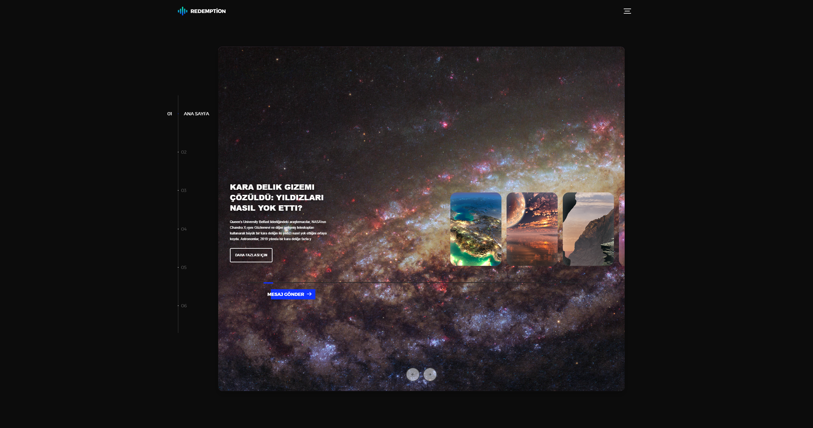
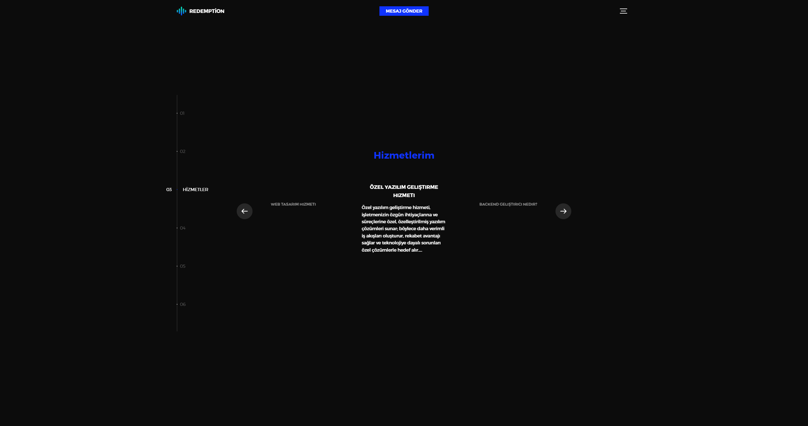
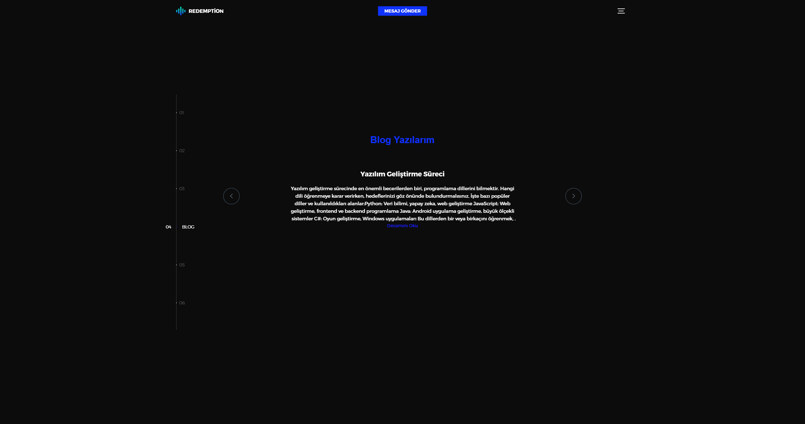
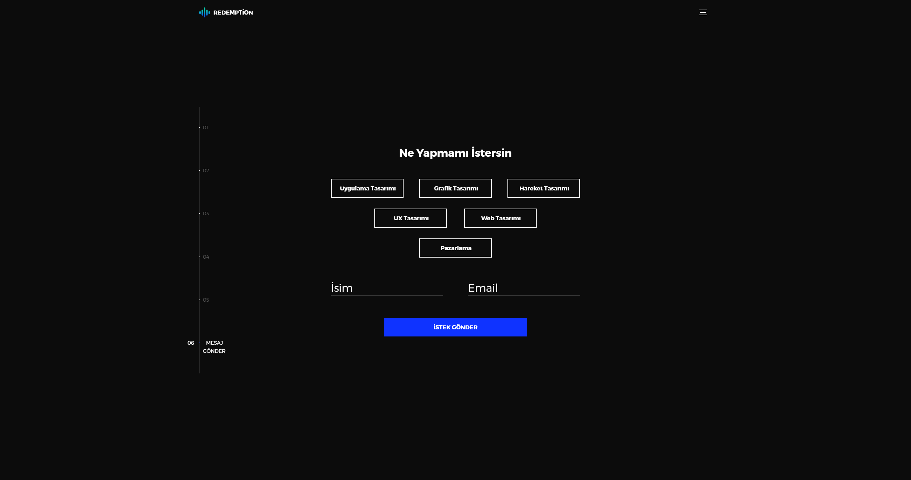
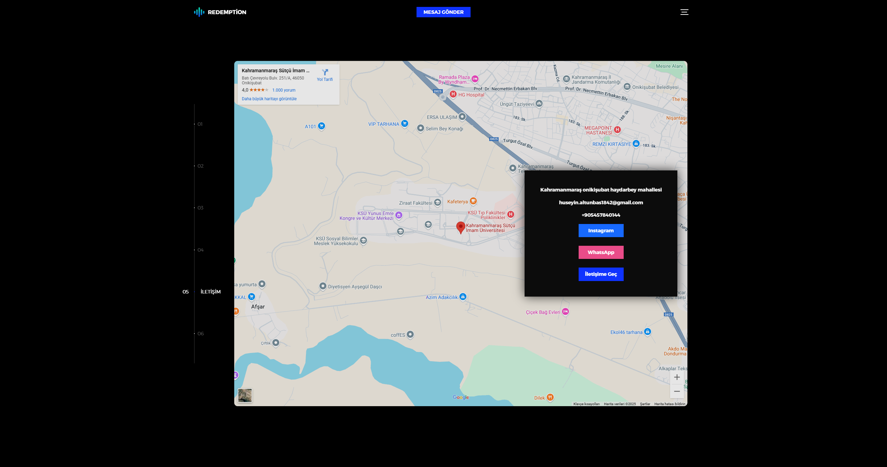

# 🌐 Redemption Portfolio Website

This repository contains **screenshots** and a **GIF demo** of the **Redemption Portfolio Website**.  
It showcases the main sections of the site and its design features.  
No source code is included — this repository is for presentation purposes only.

---

## 🎥 Demo Preview

---

## 🖼 Screenshots

### 🏠 Home Page

### 👥 About Us

### 🛠 Services

### 📰 Blog

### ✉️ Contact Form

### 🗺 Map Location

---

## ✨ Features
- Modern **dark mode** user interface  
- Smooth **animated navigation** between sections  
- Detailed **service descriptions** and project history  
- Integrated **contact form** with multiple communication options  

---

## 📜 License
This project is licensed under the **MIT License** – see the [LICENSE](LICENSE.txt) file for details.

---

## 📬 Contact
Please refer to the **Contact** section screenshot for ways to get in touch.

---
**Note:** This repository contains only visual materials (screenshots and demo GIF), not the source code.
